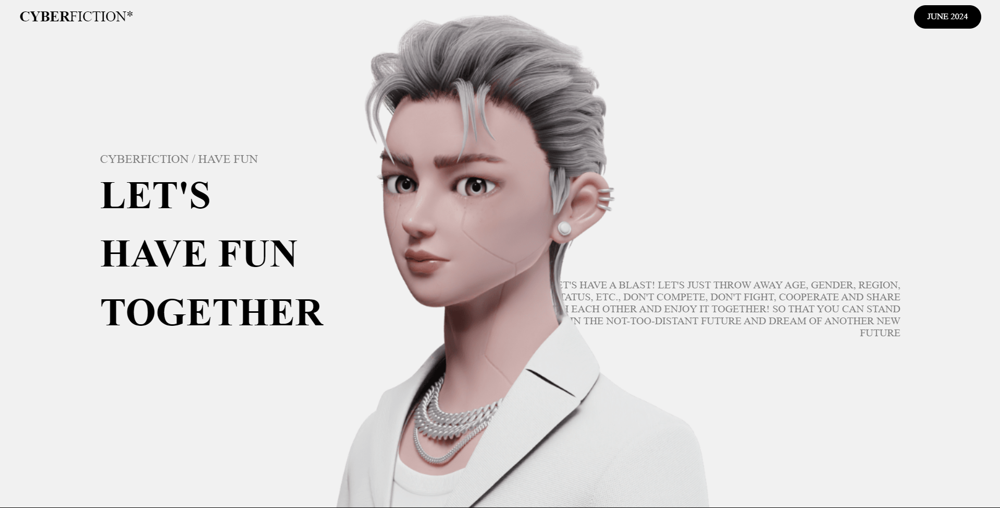

# Metaverse-Launch
# MetaVerse - CYBERFICTION* Website

This repository contains a replica of the CYBERFICTION* website, which was honored by the Awwwards Board. The website is a mesmerizing and immersive experience that showcases the concept of CYBERFICTION in the metaverse.

## Description

CYBERFICTION is a decentralized community that aims to create new values and profits through play in the virtual world. The website presents a captivating and futuristic design, combining visually stunning elements with smooth animations and transitions.

The homepage features a looping text animation that introduces the concept of CYBERFICTION as the "real story" in the metaverse. The design incorporates various sections, each with its unique style and messaging, exploring themes such as "Have Fun," "Let's Play Together," and "Playground."

The website utilizes modern web technologies, including HTML, CSS, and JavaScript, along with popular libraries like GSAP and Locomotive Scroll, to deliver a seamless and engaging user experience.

## Features

- Responsive design: The website is optimized for various screen sizes, ensuring a consistent experience across different devices.
- Smooth scrolling: Locomotive Scroll library provides smooth scrolling functionality, enhancing the overall navigation experience.
- Animations: GSAP (GreenSock Animation Platform) is used to create captivating animations and transitions throughout the website.
- Modular structure: The codebase is organized into separate HTML, CSS, and JavaScript files for better maintainability and scalability.

## Getting Started

To run the website locally, follow these steps:

1. Clone the repository: `git clone https://github.com/ahmarcode/Metaverse-Launch.git`
2. Navigate to the project directory: `cd Metaverse-Launch`
3. Open the `index.html` file in a web browser.

Alternatively, you can use a local development server to serve the website. Popular choices include [Live Server](https://marketplace.visualstudio.com/items?itemName=ritwickdey.LiveServer) for Visual Studio Code or the built-in web server in modern web browsers.

## Contributing

Contributions to this project are welcome! If you find any issues or have suggestions for improvements, please open an issue or submit a pull request.

## Credits

This project is a replica of the CYBERFICTION* website, which was honored by the Awwwards Board. The original design and concept belong to the respective owners.

## License

This project is licensed under the [MIT License](LICENSE).

